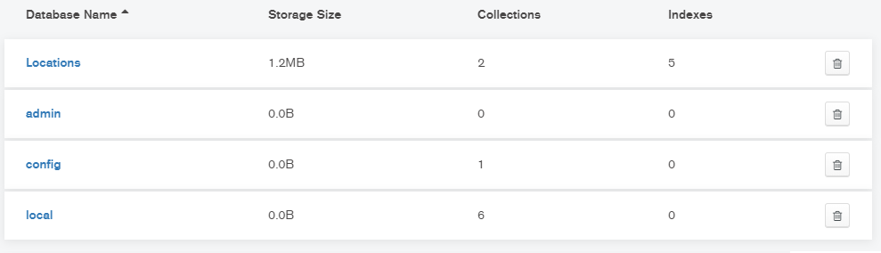
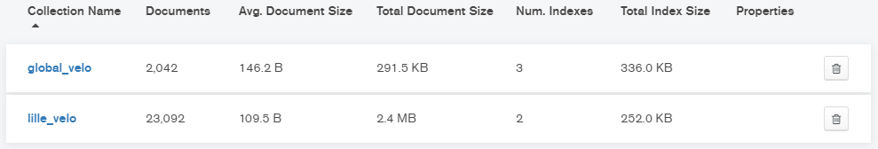
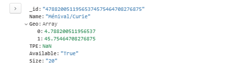
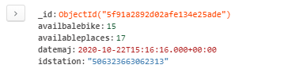

# velomongoISENVereptGreff

**Authors:** *Jean-loup Greff ; Alexandre Verept*

### Subject:

Write 4 programs in python and mongo
(1) Get self-services Bicycle Stations (geolocations, size, name, tpe, available): Lille, Lyon, Paris and
Rennes
(2) Worker who refresh and store live data for a city (history data)
(3) User program: give available stations name next to the user lat, lon with last data (bikes and stand)
(4) Business program:

- find station with name (with some letters)
- update a stations
- delete a station and datas
- deactivate all station in an area
- give all stations with a ratio bike/total_stand under 20% between 18h and 19h00 (monday to
friday)

### Our Data base structure:

At first, we have a database named `Locations`

In `Locations`, here are the collections we use:

An example of station in `global_velo`:

The `_id` is the result of the concatenation of both the latitude and longitude, as it should be unique for each station.

An example of record in `lille_velo`:

We can link each `lille_velo` record to the corresponding `global_velo` station with the `idstation`.

